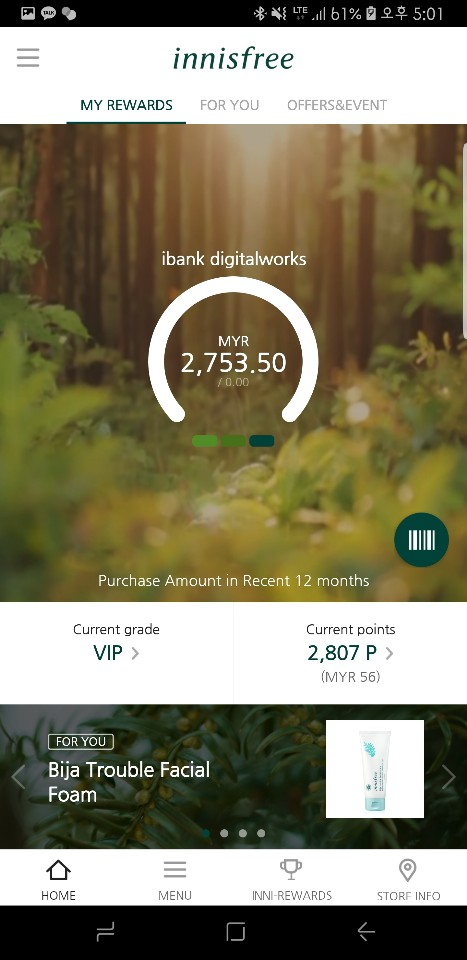
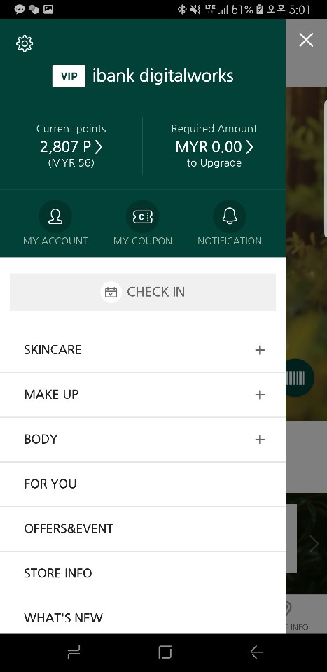
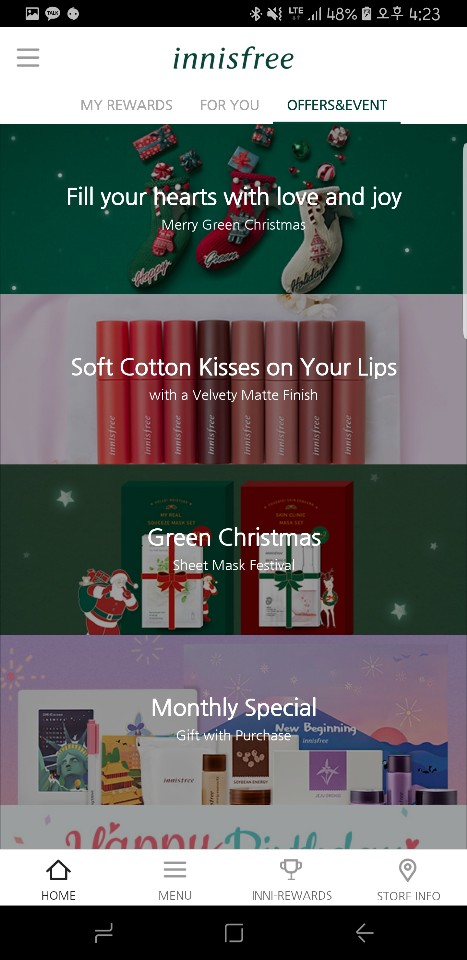
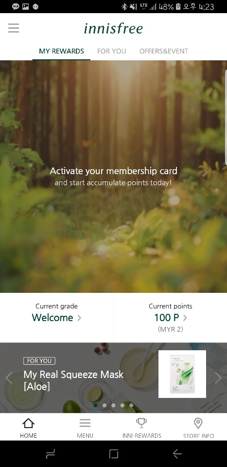
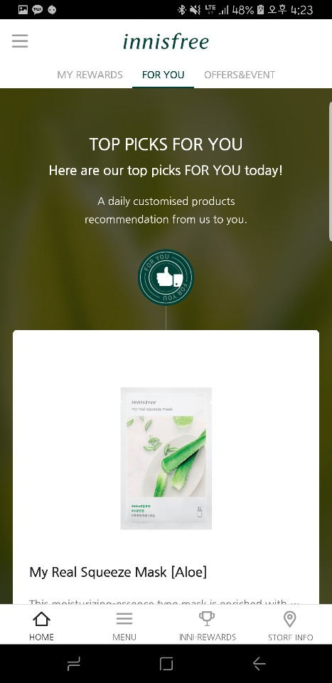
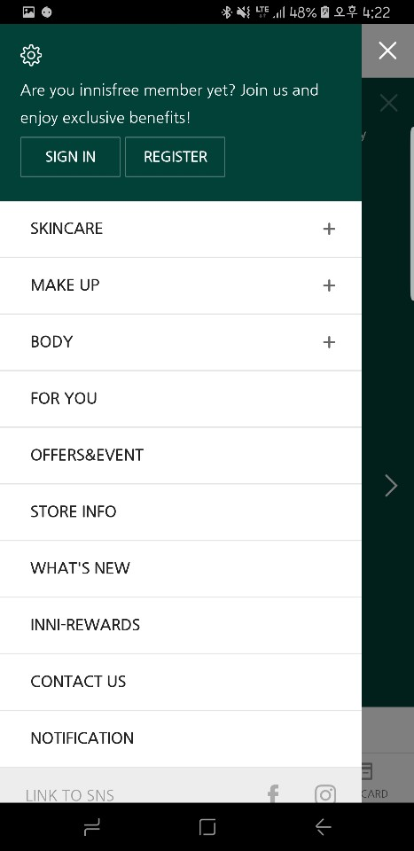
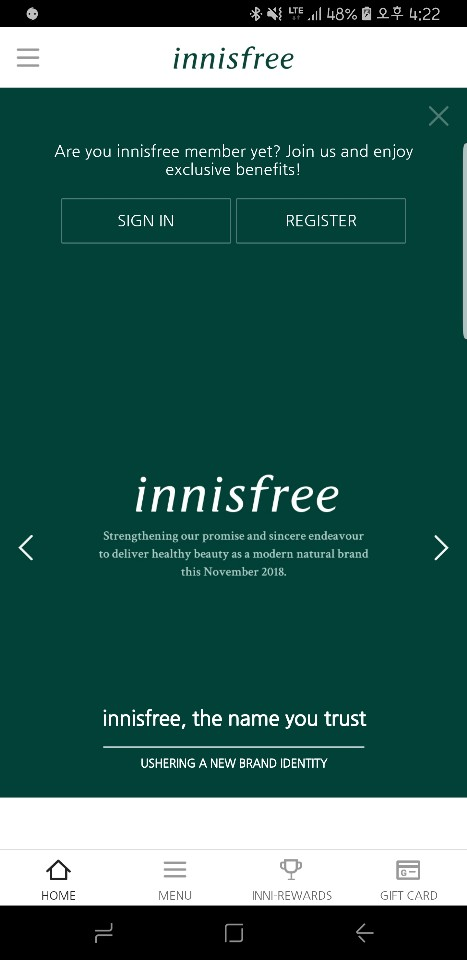

## Innisfree Global (해외)

{: width="14%" height="100%"}
{: width="14%" height="100%"}
{: width="14%" height="100%"}
{: width="14%" height="100%"}
{: width="14%" height="100%"}
{: width="14%" height="100%"}
{: width="14%" height="100%"}

### 개요
- 다수의 동남아 국가와 일본 및 홍콩 등 일부 아시아 국가를 타겟으로한 이니스프리 마케팅 어플리케이션입니다.
국내에서는 다운로드가 불가능한 어플리케이션으로, 국가에 따른 로컬라이즈 및 IP 검색을 통한 국가할당 등의 기술이 삽입되어 있습니다.
오픈 국가는 현재도 지속적으로 추가되고 있습니다.
프로젝트 PL로 참여하였으며 기본적으로 형상관리는 GitLab 을 이용하고 있고 Redmine (+fabric) 으로 고객협업과 유지보수를 겸하고 있습니다.

### 특이사항
- 계속적인 국가 추가에 따른 패턴제작
- 앱 위변조 방지
- 카드 애니메이션 기타 등
- 다국가 지원 (로컬라이즈 텍스트는 내부 삽입)
- 다수의 스크립트 인터페이스 구현
- 패키지 내부 코드로 구현된 웹뷰 다수 존재
- data bind

### 소속
- IBank Digitalworks

### 개발기간
- 2017.02 ~ 현재

### 참여도
- Android

### 개발언어
- Java
- Kotlin
- JavaScript

### 개발툴
- AndroidStudio
- Charles

### 개발환경
- Mac OS
