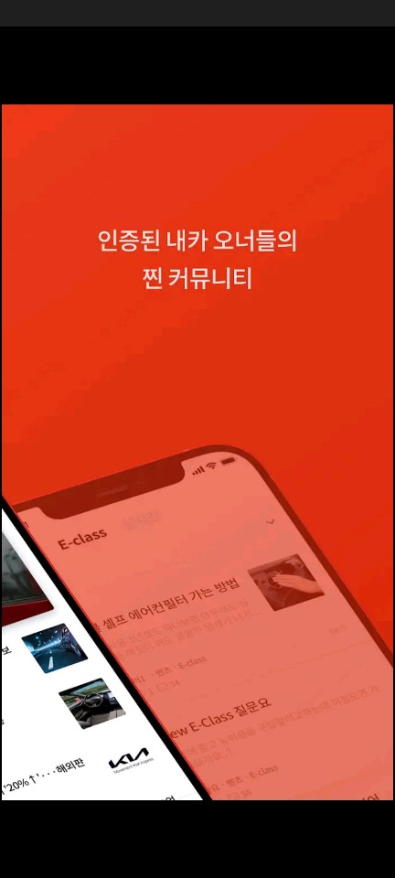
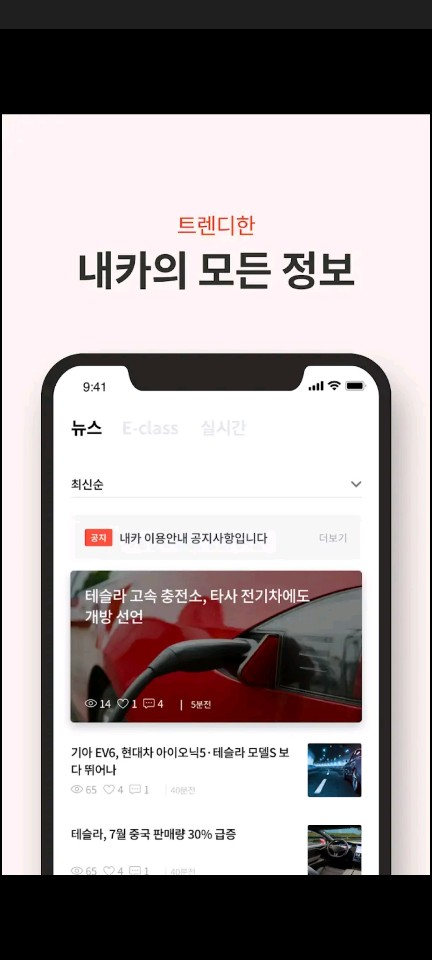
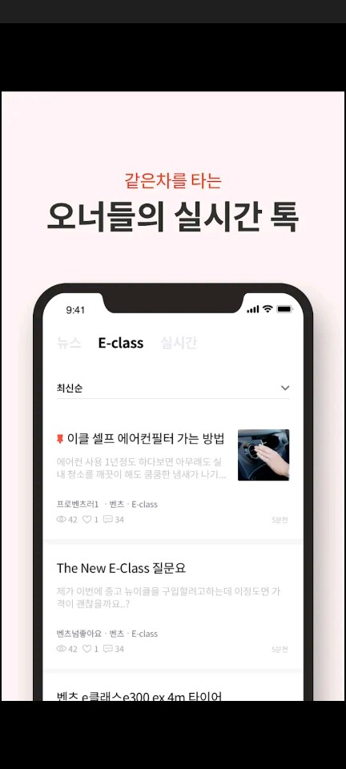

## Forever21

{: width="14%" height="100%"}
{: width="14%" height="100%"}
{: width="14%" height="100%"}
{: width="14%" height="100%"}
{: width="14%" height="100%"}

### 개요
- 
자동차 정보 공유를 위한 간단한 웹 앱 입니다.
kotlin 으로 개발되었으며, 웹 과의 동기/통신은 기본적인 자바스크립트 인터페이스를 사용하고 있습니다.

### 소속
- ContentsCarrier

### 개발기간
- 2021.08 ~ 2021.09

### 참여도
- Android

### 개발언어
- Kotlin

### 개발툴
- AndroidStudio

### 개발환경
- Mac OS
