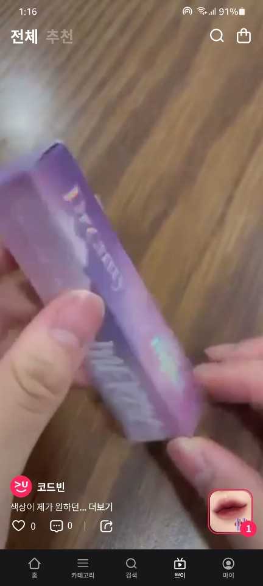

## Wallavu

{: width="14%" height="100%"}
{: width="14%" height="100%"}
{: width="14%" height="100%"}
{: width="14%" height="100%"}
{: width="14%" height="100%"}
{: width="14%" height="100%"}
{: width="14%" height="100%"}

### 개요
- 
비디오커머스, 왈라뷰 어플리케이션 입니다.
여러개의 동영상을 자동 재생하기 위해 exoplayer와 라이프사이클에 맞춘 전체 스톱,재생등을 지원하고 있습니다.
위 영상 플레이의 모토는 틱톡입니다.

### 특이사항
- MVVM
- 동영상 재생

### 소속
- ContentsCarrier

### 개발기간
- 2020.05 ~ 현재

### 참여도
- Android

### 개발언어
- Java
- Kotlin

### 개발툴
- AndroidStudio

### 개발환경
- Mac OS
