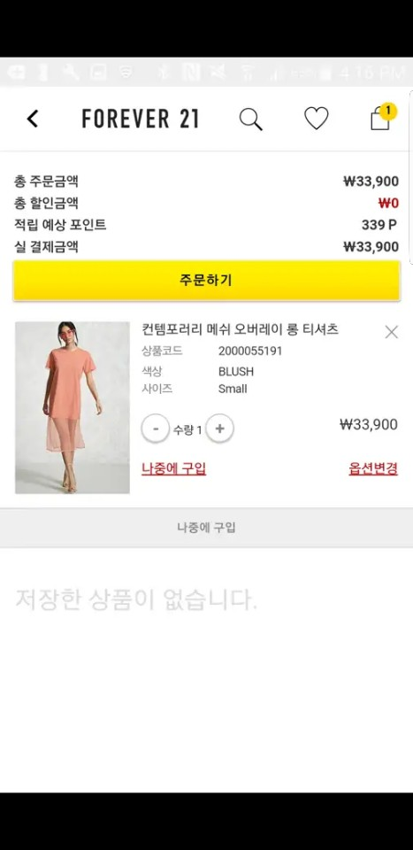
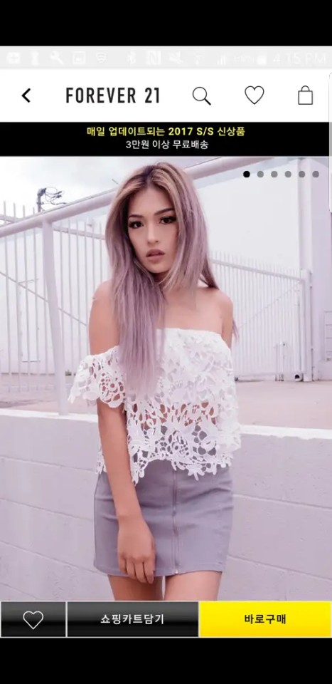
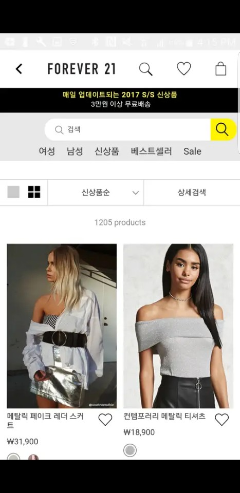

## Forever21

{: width="14%" height="100%"}
{: width="14%" height="100%"}
{: width="14%" height="100%"}
{: width="14%" height="100%"}
{: width="14%" height="100%"}

### 개요
- 
Forever21 쇼핑 몰 어플리케이션 입니다.
다수의 국가를 오픈/런칭 하였으며 iOS 의 라이프사이클을 그대로 구현하기 위한 프래그먼트 사이클을 자체 구현 하는 등의 기술을 사용하였습니다.
오픈 국가는 현재도 지속적으로 추가되고 있으며 형상관리는 GitLab 을 이용하고 있고 Redmine (+fabric) 으로 고객협업과 유지보수를 겸하고 있습니다.

### 특이사항
- 계속적인 국가 추가에 따른 패턴제작
- 앱 위변조 방지
- 다국가 지원 (로컬라이즈 텍스트는 내부 삽입)
- 다수의 스크립트 인터페이스 구현
- ButterKnife + Dagger2
- MVVM

### 소속
- IBank Digitalworks

### 개발기간
- 2017.08 ~ 현재

### 참여도
- Android

### 개발언어
- Java
- Kotlin
- JavaScript

### 개발툴
- AndroidStudio
- Charles

### 개발환경
- Mac OS
