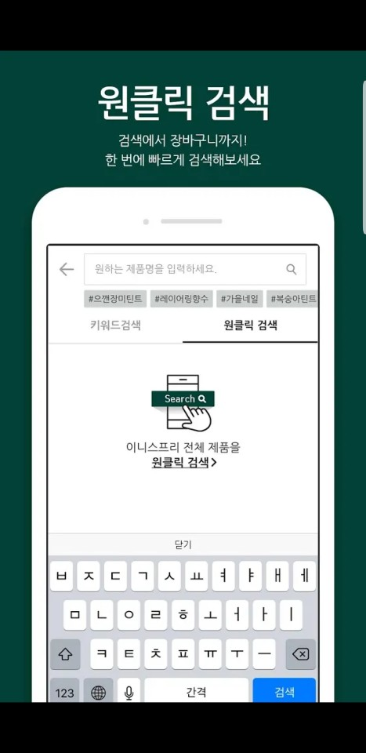
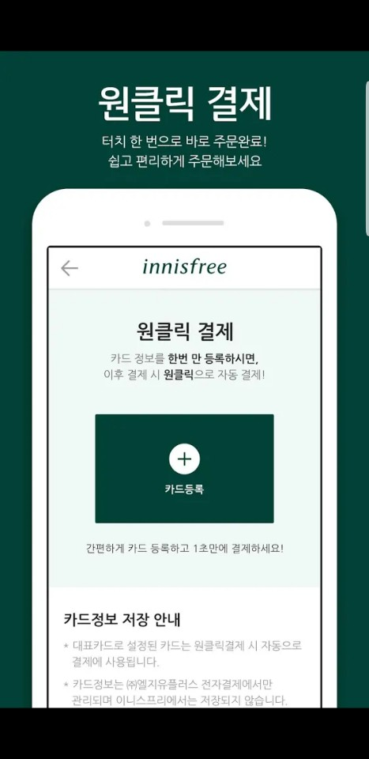
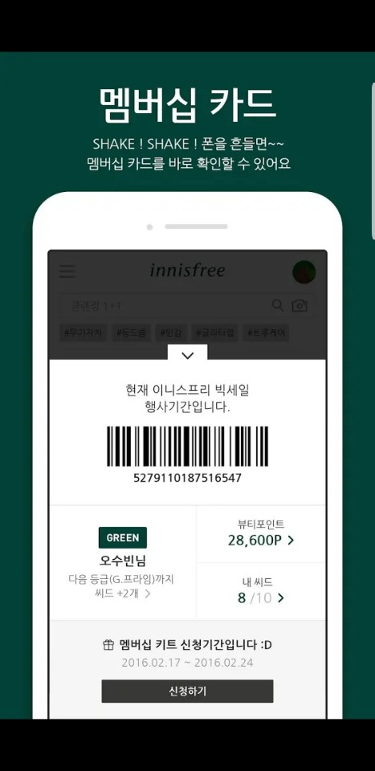
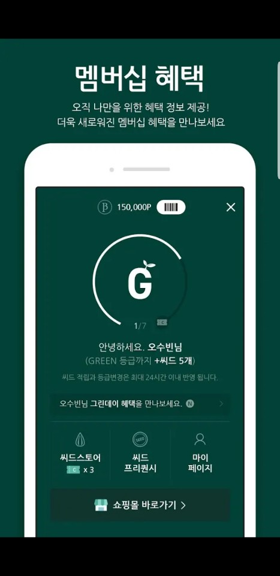

## 이니스프리

{: width="19%" height="100%"}
{: width="19%" height="100%"}
{: width="19%" height="100%"}
{: width="19%" height="100%"}
{: width="19%" height="100%"}

### 개요
- 이니스프리 국내 사용자를 위한 쇼핑몰 어플리케이션 입니다.
Gitlab, Redmine, Fabric 등을 사용하고 있으며 사용자 분석및 행위 파악을 위한 다수의 Tracker 가 탑재되어 있습니다.
최근 피부 진단을 위한 뷰티테일러 등이 삽입되었으며, 앱 내부에서의 세션 핸들링 등을 다루고 있습니다.

### 특이사항
- 앱 전체 구조변경 및 리팩토링 경험
- 필요에 따른 특정부위만 다른 패턴으로 개발을 진행함으로써 유지보수성 향상
- 다수의 fragment 제어
- 초성 검색등의 반영
- 메모리 핸들링

### 소속
- IBank Digitalworks

### 개발기간
- 2017.11 ~ 2018.02

### 참여도
- Android

### 개발언어
- Java
- Html
- JavaScript

### 개발툴
- AndroidStudio
- Charles

### 개발환경
- Mac OS
