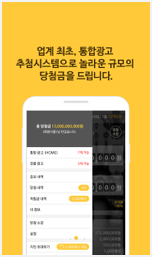
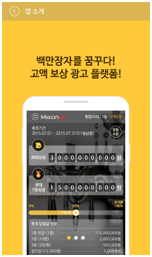
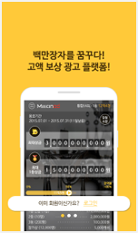
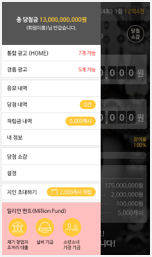

## 밀리언 애드 (현 밀리언 써클)

### 개요
- 퀴즈쇼 및 광고응모로 보상을 받는 리워드형 어플리케이션 입니다. 

### 소속
- S-Soft

### 개발기간
- 2016.02 ~ 2016.05

### 참여도 (%)
- Android (100%)
- Admin Page (php) (100%)
- API (MySql, Xml) (100%)
- ServerSetting (Cafe23 Host, AutoSet, Apache Tomcat)

### 개발언어
- Java
- Php
- MySql
- JavaScript

### 개발툴
- AndroidStudio
- Autoset (Server)
- Aptana
- Sequal Pro

### 개발환경
- Mac OS
