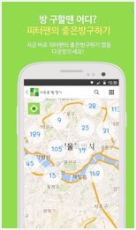

## 피터팬의 좋은 방 구하기

### 개요
- Naver 까페, 피터팬의 좋은 방 구하기의 안드로이드 어플리케이션 버전 입니다.
REST API 를 기반으로 특정 부위에 대한 MarkerCluster, 바이너리 데이터 다중 업로드 및 제어, 사진 필터링 등의 기술이 적용되었습니다.

### 소속
- S-Soft

### 개발기간
- 2015.03 ~ 2015.06

### 참여도 (%)
- Android (100%)
- Admin Page (php) (100%)
- API (MySql, Xml) (100%)
- ServerSetting (Cafe23 Host, AutoSet, Apache Tomcat)

### 개발언어
- Java
- Php
- MySql
- JavaScript
- AQuery

### 개발툴
- AndroidStudio
- Autoset (Server)
- Aptana
- HeidiSQL
- SQLGate

### 개발환경
- Window7
